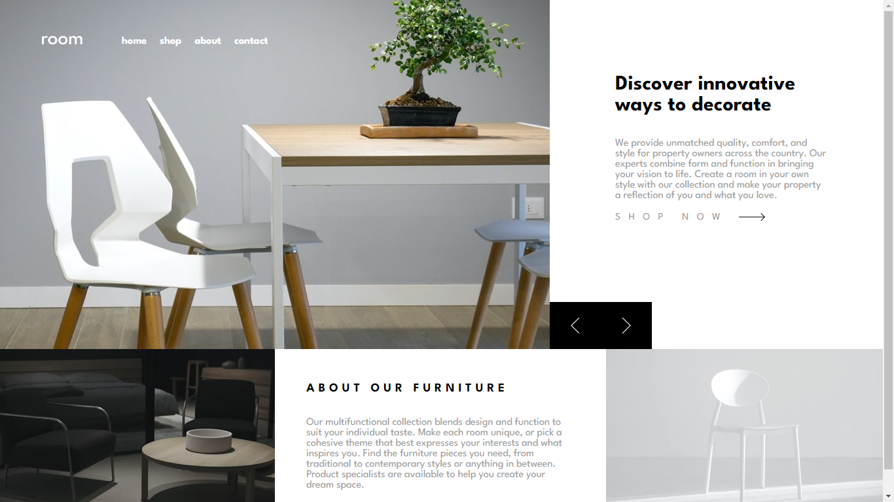
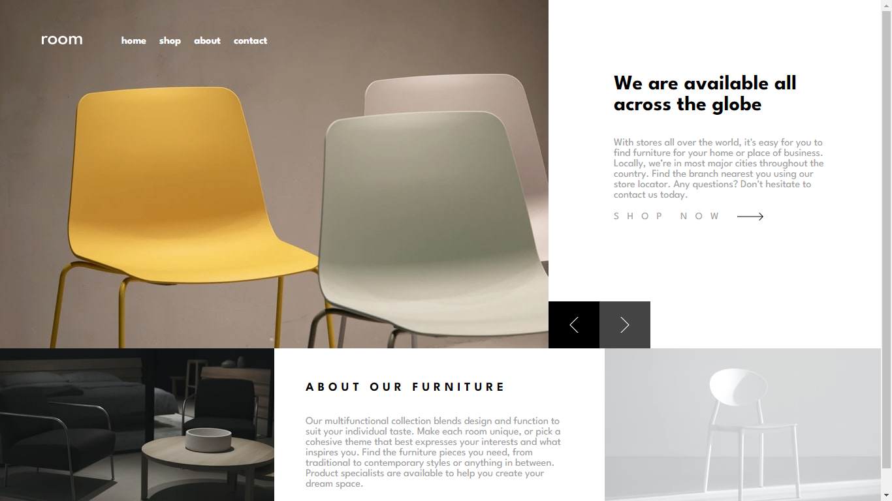
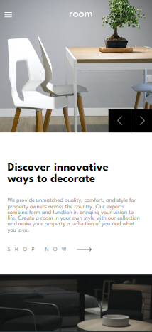
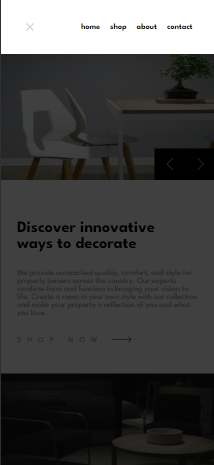

# Frontend Mentor - Room homepage solution

This is a solution to the [Room homepage challenge on Frontend Mentor](https://www.frontendmentor.io/challenges/room-homepage-BtdBY_ENq). Frontend Mentor challenges help you improve your coding skills by building realistic projects. 

## Table of contents

- [Overview](#overview)
  - [The challenge](#the-challenge)
  - [Screenshot](#screenshot)
  - [Links](#links)
- [My process](#my-process)
  - [Built with](#built-with)
  - [What I learned](#what-i-learned)
  - [Continued development](#continued-development)
  - [Useful resources](#useful-resources)
- [Author](#author)
- [Acknowledgments](#acknowledgments)

**Note: Delete this note and update the table of contents based on what sections you keep.**

## Overview

### The challenge

Users should be able to:

- View the optimal layout for the site depending on their device's screen size
- See hover states for all interactive elements on the page
- Navigate the slider using either their mouse/trackpad or keyboard

### Screenshot

#### Desktop view





#### Mobile view





### Links

- Solution URL: [Add solution URL here](https://your-solution-url.com)
- Live Site URL: [Add live site URL here](https://your-live-site-url.com)

## My process

### Built with

- Semantic HTML5 markup
- CSS custom properties
- Flexbox
- CSS Grid
- [React](https://reactjs.org/) - JS library
- Testing


### What I learned

Working on this project allowed me to solidify my understanding of React and TypeScript integration. This was an opportunity to advance in my journey to becoming a frontend developer. Here are some code snippets that I'm particularly proud of:

#### CSS

```css
.shopnow:hover {
  filter: invert(1) brightness(0.5);
  cursor: pointer;
}
```

#### JavaScript (React)

```jsx
const[currentImage, setCurrentImage] = useState(0);
const previousImage = () => {
    setCurrentImage(prevIndex => (prevIndex === 0 ? imageDescription.length - 1 : prevIndex - 1));
};

const nextImage = () => {
    setCurrentImage(prevIndex => (prevIndex === imageDescription.length - 1 ? 0 : prevIndex + 1));
};

useEffect(() => {
    const detectKeyDown = (e: KeyboardEvent) => {
        if (e.key === 'ArrowLeft') {
            previousImage();
        } else if (e.key === 'ArrowRight') {
            nextImage();
        }
    };
```

### Continued development

In future projects, I aim to delve deeper into:

- Improving performance optimization techniques in React
- Enhancing user experience with animations and transitions using Framer Motion


### Useful resources

- [Asap Frontend](https://asapfrontend.com/) - This site helped me with my initial learning of react and it made me grasp the basics of certain React Hooks like UseState and UseEffect.
- [React Documentation](https://react.dev/) - This is an amazing article which helped me finally understand XYZ. I'd recommend it to anyone still learning this concept.
- [W3Schools](https://www.w3schools.com/REACT/)


## Author

- Website - [E-commerce Homepage](https://www.your-site.com)
- Frontend Mentor - [@yourusername](https://www.frontendmentor.io/profile/yourusername)
- Twitter - [@yourusername](https://www.twitter.com/yourusername)

## Acknowledgments

This is where you can give a hat tip to anyone who helped you out on this project. Perhaps you worked in a team or got some inspiration from someone else's solution. This is the perfect place to give them some credit.

**Note: Delete this note and edit this section's content as necessary. If you completed this challenge by yourself, feel free to delete this section entirely.**
